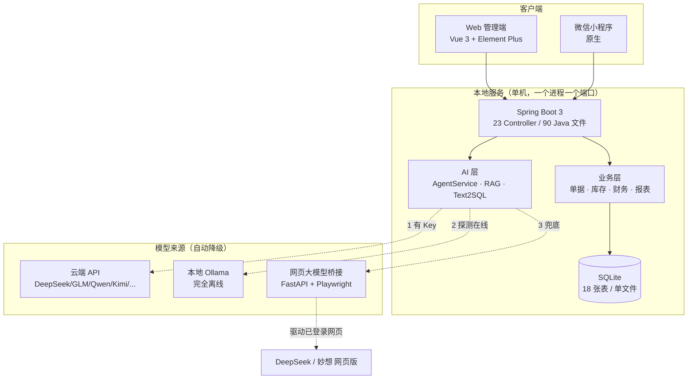

<div align="center">

# 账管卫士 · LocalERP

**本地优先的「进销存 + 财务记账 + AI 智能体」一体化系统**

单机运行 · 数据不上云 · 自带 JRE 免安装分发 · AI 零成本可跑

[](https://github.com/jiuchen035-blip/local-erp/releases)
[](https://openjdk.org/)
[](https://spring.io/projects/spring-boot)
[](https://vuejs.org/)
[](https://sqlite.org/)
[](https://fastapi.tiangolo.com/)
[](LICENSE)

**Function Calling Agent · 网页大模型桥接 · 三来源自动降级 · RAG · Text2SQL · 自动凭证**

</div>

---

## 这是什么

**账管卫士**是一套给小微商家（单店 1–3 人）用的本地经营管理系统，把三件事做进一个程序里：

| 模块 | 做什么 |
|---|---|
| 📦 进销存 | 商品 / 多仓库 / 批次保质期 / 采购销售退货盘点调拨全单据流 |
| 💰 财务记账 | 单据过账**自动生成会计凭证**、价税分离、三大报表、期末结转 |
| 🤖 AI 智能体 | 自然语言**开单**、查数据、RAG 知识库问答、Text2SQL 只读统计 |

它的三个硬约束决定了一切设计：

| 约束 | 设计选择 |
|---|---|
| 商家不是 IT，不许装 Java / 数据库 | SQLite 单文件 + jpackage 自带精简 JRE + Inno Setup 安装包，**双击即用** |
| 经营数据不上云 | 所有数据落在程序目录 `data/`，备份/迁移就是拷文件 |
| 商家多半没有 API Key | **云端 API → 本地 Ollama → 网页版大模型** 三来源自动降级，没 Key 也能跑 AI |

> 从 0.1.0 迭代到 0.6.0，共 6 个大版本，老库幂等迁移，**用户数据零丢失**。

---

## 亮点速览

### 🧠 AI 层（本项目最硬的部分）

- **自研网页版大模型桥接服务** —— 用 Playwright 驱动**无官方 API** 的网页版大模型（DeepSeek / 东方财富妙想），在本地封装成**标准 OpenAI 兼容接口**（`/v1/chat/completions`）。AI 功能因此可以**零 API 成本**运行。内含登录态持久化、站点级串行锁、登录特征优先判定、流式输出静默判定等一整套工程化细节。
- **Function Calling 文本协议双向转换** —— 网页模型不支持原生 Function Calling。桥接层在**请求侧**把 tools 定义渲染成文本协议注入 prompt，**响应侧**用正则解析 `<tool_call>{...}</tool_call>` 并还原成标准 `tool_calls` 结构。结果：**Java 端的 Agent 循环完全感知不到背后是网页模型**，23 个业务工具、多轮编排跑通（查商品 → 自动建档 → 开草稿单，实测 3–4 轮稳定）。
- **三来源模型自动降级路由** —— 单请求级路由：有效 API Key → 云端；探测到本地 Ollama → 本地模型；都没有 → 自动拉起网页桥接。降级**只作用于本次请求、不污染全局配置**，前端实时显示当前来源与降级原因。
- **人机协同安全边界** —— AI 的写操作**只能到「草稿单」为止**，过账必须人工点击确认。从机制上把大模型幻觉挡在账务之外。
- **RAG 知识库问答** —— 关键词（中文 2-gram 加权）+ 语义（Embedding 余弦）双路检索，答案强制标注来源、检索不到明确回答「不知道」；支持 Word / PDF / Excel 文档解析入库。
- **Text2SQL 强制只读** —— 自然语言查经营数据，非 `SELECT` 直接拒绝 + 关键词黑名单。

### 🏗 工程层

- **库存 = 流水聚合**：单据过账是流水的唯一入口，移动加权平均成本，整单折扣按行分摊，冲正生成镜像单不删原单 —— 账实一致、可追溯、可审计。
- **异构 ERP 数据智能导入**：前端 SheetJS 解析任意来源的导出表 → 两阶段**自动猜列**（可人工修正）→ 支持独立三级分类列与 `a/b/c` 整串两种格式、SKU 保留/重生成、按 SKU+条码去重、期初库存自动生成盘整流水。实测 3 行到 1440 行的异构表均正常。
- **备份恢复零冲突设计**：SQLite `VACUUM INTO` 热备（启动 / 每晚 / 手动，保留 30 份）；恢复采用「挂起文件 + 启动窗口换库」，在数据源初始化之前替换主库，零连接冲突，恢复前自动再备份当前库。
- **老库平滑升级**：所有 schema 变更走 `try-catch ALTER` 幂等迁移，6 个大版本升级用户数据零丢失。
- **一键打包分发**：`jpackage` 绿色版（自带精简 JRE + 数据自包含）+ Inno Setup 单文件安装包 + PowerShell 一键流水线；后端按需自动拉起配套 Python 桥接服务。

---

## 系统架构



### AI Agent 一次完整工具编排

```mermaid
sequenceDiagram
    autonumber
    participant U as 用户
    participant A as AgentService (Java)
    participant R as AiRouter
    participant B as WebLLM Bridge (Python)
    participant M as 网页版大模型

    U->>A: "帮张三开一张 3 瓶可乐的销售单"
    A->>R: chat(messages, tools=23)
    R->>B: POST /v1/chat/completions
    Note over B: 请求侧：tools 定义 → 文本协议注入 prompt<br/>用户请求置底 + 禁止复述工具说明
    B->>M: Playwright 注入并发送
    M-->>B: 输出 &lt;tool_call&gt;{"name":"search_products"}&lt;/tool_call&gt;
    Note over B: 响应侧：正则解析 → 还原为 OpenAI tool_calls
    B-->>R: tool_calls（标准结构）
    R-->>A: tool_calls
    A->>A: 执行工具 → 结果以 role:tool 拼回上下文
    A->>R: 再次 chat（带工具结果）
    R->>B: ...
    B-->>A: create_draft_bill（草稿，未过账）
    A-->>U: 草稿单已生成，请确认过账
    Note over U,A: 过账必须人工点击 —— AI 幻觉止步于草稿
```

---

## 功能地图

<table>
<tr><td width="50%" valign="top">

**经营**
- 经营看板：今日/本月销售额毛利、库存价值、14 天趋势、热销 Top5
- 经营报表：月/季/年维度、导出多 Sheet Excel、**AI 美化生成经营分析报告**
- 库存预警：低库存补货 + 批次临期查询（可导出催检/催补单）

**商品与库存**
- 三级分类（分类浏览 / 全部视图切换）
- 名称 / SKU / 条码搜索，扫码枪直接开单
- 基本单位与大件单位换算（1 箱 = 24 瓶）
- 批次号、生产日期、保质期天数、多仓库明细
- 三种价格（零售 / 批发 / 会员）+ 商品图片

**单据**
- 7 种单据：采购 / 销售 / 采购退货 / 销售退货 / 报损 / 盘盈 / 调拨
- 草稿 → 过账 → 冲正，整单折扣按行分摊
- 库存盘点：录实盘数 → 差异自动生成盘盈/报损单并过账

</td><td width="50%" valign="top">

**财务**
- 单据过账**事务内自动生成会计凭证**
- 增值税价税分离（含税开单自动拆净额/销项/进项）
- 借贷平衡强校验、手工凭证
- 科目余额表、明细账、资产负债表 + 利润表
- 期末结转损益、年度结转、凭证套打

**AI 助手**（聊天页一站式）
- 智能开单 Agent（23 个工具编排，聊天页内确认过账）
- 查经营数据（Text2SQL 只读）
- 知识库 RAG 问答（附来源）
- AI 设置：8 家模型厂家 + 在线拉模型列表 + 连通性测试 + 热生效

**往来与系统**
- 供应商 / 客户档案 + 期初应收应付、挂账核销结清、对账单打印
- 多仓库 + 调拨、同行调货（自动生成两张关联单）
- 灭火器年检（行业专用）：到期标红、催检名单、一键续检
- 系统设置：操作员管理、备份管理、操作日志

</td></tr>
</table>

---

## 技术栈

| 层 | 技术 | 说明 |
|---|---|---|
| 后端 | Spring Boot 3.3 · MyBatis-Plus · SQLite | 单体架构，自写 `AuthInterceptor` 鉴权 + BCrypt |
| 前端 | Vue 3 · Vite · Element Plus | **刻意不引入 vue-router**，单页多组件切换，减少依赖 |
| AI 协议 | OpenAI 兼容（`/v1/chat/completions`） | 一套封装接 8 家模型厂家 |
| AI 桥接 | Python 3 · FastAPI · Playwright | 驱动网页版大模型，暴露 OpenAI 兼容接口 |
| 小程序 | 原生微信小程序 | 13 个页面，复用后端全部 API |
| 打包 | jpackage · Inno Setup 6 · PowerShell | 绿色版 zip + 单文件 Setup.exe |
| 文档解析 | Apache POI · PDFBox | Word / Excel / PDF 入库知识库 |

---

## 快速开始

### 方式一：直接用打包好的程序（推荐给使用者）

1. 到 [Releases](https://github.com/jiuchen035-blip/local-erp/releases) 下载 `账管卫士-绿色版-x.x.x.zip`
2. **解压到任意目录**（必须解压，解压后 exe 旁边要能看到 `app/` 和 `runtime/`）
3. 双击 `账管卫士.exe` → 浏览器自动打开管理界面
4. 默认账号 `admin / admin123`（首次登录后请修改密码）

> 无需安装 Java、无需安装数据库。Windows 10/11 64 位。

### 方式二：从源码运行（推荐给开发者）

```bash
# 1. 后端（需要 JDK 17 + Maven）
cd backend
mvn -DskipTests package
java -jar target/local-erp-0.6.0.jar        # → http://localhost:8080

# 2. 前端（另开一个终端，需要 Node 18+）
cd frontend
npm install
npm run dev                                  # → http://localhost:5173
```

生产部署：`npm run build` 后前端产物自动打进 jar 的 `static/`，**一个 jar 一个端口跑全系统**。

> ⚠️ **已知坑**：项目路径含中文/空格时不要用 `mvn spring-boot:run`，JVM 参数文件在中文 Windows 下编码错乱会报 `ClassNotFoundException`，请统一用 `java -jar`。

### 方式三：启用「网页版大模型」（零 API 成本跑 AI）

```bash
cd webllm
pip install -r requirements.txt
playwright install chromium
python server.py                             # → 127.0.0.1:8317
```

然后在管理界面 **AI 助手 → 右上角 ⚙ → 厂家选「网页版模型（免 API）」→ 点登录**，在弹出的浏览器里登录一次即可（登录态存本地，长期有效）。之后后端会自动托管这个桥接服务。

---

## 目录结构

```
local-erp/
├── backend/                     Spring Boot 后端（90 个 Java 文件）
│   └── src/main/java/com/local/erp
│       ├── controller/          23 个 REST 控制器
│       ├── service/             业务层：单据过账 / 财务凭证 / 知识库 / 备份
│       ├── ai/                  ★ AgentService · AiRouter · ModelClient · WebLlmBridgeService
│       ├── entity/ mapper/ dto/
│       ├── config/              鉴权 / 幂等迁移 / 全局异常
│       └── integration/         电商平台适配器接口
├── frontend/                    Vue 3 管理端（18 个页面）
├── miniprogram/                 原生微信小程序（13 个页面）
├── webllm/                      ★ 网页大模型桥接服务（FastAPI + Playwright）
│   ├── server.py                OpenAI 兼容接口 + 站点串行锁
│   ├── toolcall.py              ★ Function Calling 文本协议双向转换
│   └── adapters/                DeepSeek / 东方财富妙想 站点适配器
├── package/                     打包流水线（jpackage + Inno Setup）
├── docs-代码说明书/              12 篇从零讲解的工程文档
└── README.md
```

---

## 核心设计决策

**为什么 SQLite 而不是 MySQL？**
目标用户是单店商家，零运维是硬需求。SQLite 就是一个文件，拷走即备份、删掉即重置。它只有单写者并发，但单店场景完全够用；真做多门店，业务层都是 MyBatis-Plus 标准 SQL，换 PostgreSQL 成本很低。

**为什么自研 Agent 循环，不用 LangChain？**
一是本地软件不能背 Python 全家桶；二是循环本身不复杂（`while` + `chat` + 解析 `tool_calls` + 拼回上下文，百行级）；三是只有自研才能在协议层做两件关键的事 —— 网页模型的文本 FC 转换，和"AI 只产草稿"的安全边界。

**数据恢复为什么要重启？**
恢复 = 用备份覆盖主库，在线做会和连接池里的活跃连接冲突。方案是恢复时只落一个"挂起文件"，应用重启后在数据源初始化之前的窗口完成替换 —— 那时还没有任何连接，零冲突。替换前还会把当前库自动备份一份，恢复错了也能退回来。

**网页模型行为不可控怎么治理？**
网页模型每次对话都像"新员工"。踩过的三个真实坑：① 模型不干活反而复述工具清单 → prompt 重排，用户请求置底 + 显式禁止复述；② 模型跑去做联网搜索 → 发送前程序化关闭站点联网开关 + 指令约束；③ 登录检测误报（登录页也有输入框）→ 改为登录特征优先判定。结论：**能程序化锁死的，绝不靠模型自觉**。

---

## 文档

| 文档 | 内容 |
|---|---|
| [功能与配置手册](docs-代码说明书/12-功能与配置手册.md) | 全功能说明、AI 模型配置、FAQ |
| [打包教程](打包教程.md) | jpackage + Inno Setup 打包全流程 |
| [踩坑记录与技术要点](踩坑记录与技术要点.md) | 开发过程中真实踩过的坑 |
| [docs-代码说明书/](docs-代码说明书/) | 12 篇从零讲解：启动流程 / 数据库与核心算法 / AI 怎么跑 / 排错实战 |

---

## 常见问题

<details>
<summary><b>双击 exe 报「Failed to launch JVM」？</b></summary>

90% 是**绿色版没解压就直接双击了**。必须先把整个文件夹解压出来再运行 —— 判断标准：exe 旁边必须有 `app/` 和 `runtime/`。如果已解压仍报错，双击同目录的 `账管卫士-控制台启动.bat`，它会绕过启动器直接把真实报错打印在黑窗口里。
</details>

<details>
<summary><b>网页版模型报「未登录」？</b></summary>

登录态存在 `webllm/profile/`。到 AI 设置 → 点对应的「DeepSeek 登录 / 妙想登录」，在弹出的浏览器里完成登录即可。
</details>

<details>
<summary><b>端口 8080 被占用？</b></summary>

启动时加参数：`账管卫士.exe --server.port=18080`
</details>

<details>
<summary><b>怎么重置全部数据？</b></summary>

停止程序后删除 `data/` 目录即可（开发态是 `backend/data`）。
</details>

<details>
<summary><b>AI 网页模式响应慢？</b></summary>

正常现象 —— 网页对话 + 单站点串行。对速度有要求请配置任意厂家 API Key（智谱 `glm-4-flash`、硅基流动等都有免费额度）。
</details>

---

## License

[MIT](LICENSE) © 2026

<div align="center">
<sub>如果这个项目对你有帮助，点个 ⭐ Star 是最大的鼓励</sub>
</div>
